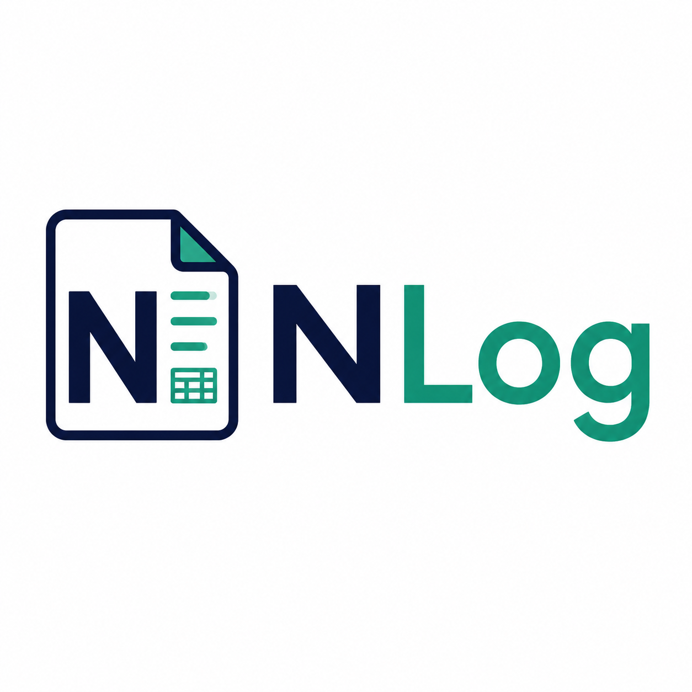

# NLog — Invoice Generator

Mobile-first PWA that turns supplemented markdown worklogs into Alchemy Dev invoices.

**Live:** [nlog.kaila-app.com](https://nlog.kaila-app.com)



## What it does

NLog reads worklog markdown files from multiple projects, filters entries by an invoice timeline, calculates the billable total, and exports a finished invoice as **PDF** and **XLSX**.

Typical flow:

1. **Worklog** — add one or more `.md` files (from different folders/projects)
2. **Details** — set timeline, rate, tax, discount, and Wise payment link
3. **Review & Export** — preview line items and download the invoice

## Features

- **Multi-file worklogs** — merge markdown files from different projects into one invoice
- **Timeline filtering** — date range (required) and optional time-of-day range
- **Chronological sorting** — line items ordered by session start time across all sources
- **Billable amount preview** — see total due before creating a Wise payment link
- **Dual export** — PDF and XLSX from a shared invoice model
- **Groq AI repair** — messy or partially invalid worklogs are repaired server-side before billing
- **AI invoice report** — Review step summarizes scope, project mix, and data-quality risks
- **USD → PHP conversion** — live mid-market rate shown on billable totals; Logger uses the same rate
- **Invoice history** — exported invoices are saved on-device for later review and re-download
- **Time adjustments** — increase/decrease entry hours, bulk adjust billable rows, or add manual adjustment entries
- **Project paths / OneDrive** — save local folders or OneDrive share links and fetch `.md` worklogs
- **Private Microsoft login** — app and APIs require sign-in; optional email allowlist
- **PWA** — installable, offline-capable after first load

## Worklog format

Each markdown file must contain a GFM table with these columns:

| Time | DESCRIPTION | QTY |
|---|---|---:|
| July 1, 2026, 3:13 PM – 3:23 PM | Java Lava — Task title, July 1, 2026. Work description here. | 0.17 Hours |

- **Time** — session start/end; used for filtering and sorting (not exported to the invoice)
- **DESCRIPTION** — project prefix before `—`, then task title and narrative
- **QTY** — decimal hours with `Hours` suffix

See the reference draft: [`docs/invoice-worklog-draft-template/invoice-worklog-draft.md`](docs/invoice-worklog-draft-template/invoice-worklog-draft.md).

## Payment links

| Field | Behavior |
|---|---|
| **Account Link** | Fixed on every invoice: `https://wise.com/pay/me/johnmarkagustinestrososa` |
| **Wise Payment Link** | Optional per-invoice link you create for the exact amount due; falls back to the account link when empty |

## Tech stack

- Vite 6 + React 19 + TypeScript
- Tailwind CSS v4
- Zustand, React Hook Form, Zod
- ExcelJS (XLSX), React-PDF (PDF)
- Groq (`llama-3.3-70b-versatile`) via `/api/*` (Vite plugin locally, Vercel Edge in production)
- vite-plugin-pwa

## Getting started

```bash
cp .env.example .env.local
# set GROQ_API_KEY and VITE_MSAL_CLIENT_ID in .env.local
# optional: NLOG_ALLOWED_EMAILS=you@outlook.com
npm install
npm run dev
```

Open [http://localhost:5173](http://localhost:5173) and sign in with Microsoft.

### Build

```bash
npm run build
npm run preview
```

Output is written to `dist/`.

## Deploy

### Vercel

| Setting | Value |
|---|---|
| Build command | `npm run build` |
| Output directory | `dist` |
| Custom domain | `nlog.kaila-app.com` |
| Env var | `GROQ_API_KEY` (server-only) |
| Env var | `VITE_MSAL_CLIENT_ID` (Azure SPA app for Microsoft login / OneDrive) |
| Env var | `NLOG_AUTH_SECRET` (email/password JWT signing) |
| Env var | `NLOG_REGISTER_CODE` (optional invite code for registration) |
| Env var | `NLOG_ALLOWED_EMAILS` (optional allowlist, comma-separated) |
| Env var | `BREVO_API_KEY` / `NLOG_FROM_EMAIL` / `NLOG_APP_URL` (password reset email) |
| Env var | `UPSTASH_REDIS_REST_URL` / `UPSTASH_REDIS_REST_TOKEN` (Vercel user store for register) |

`vercel.json` is included for SPA routing (API routes under `/api` are excluded from the rewrite).

### Laragon (local)

```bash
npm run build
```

Point a virtual host document root to `dist/` (e.g. `nlog.test`).

## Project structure

```
src/
├── components/     # UI, forms, wizard steps
├── lib/            # parser, timeline, totals, exporters, Groq client
├── pages/          # GeneratePage wizard
└── store/          # Zustand invoice state

api/
├── enhance-worklog.ts   # Groq worklog repair (Vercel Edge)
└── invoice-report.ts    # Groq invoice quality report

server/
└── groq.ts         # Shared Groq prompts + validation

public/
├── templates/      # invoice-template.xlsx
└── icons/          # PWA icons

docs/
├── invoice-template/               # reference PDF/XLSX output
└── invoice-worklog-draft-template/  # reference worklog input
```

## License

Private — John Mark Agustin E. Acido
